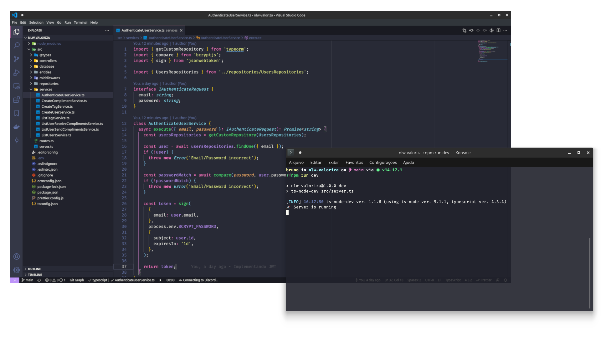

# Valoriza

  

## ✨ Tecnologias

Esse projeto foi desenvolvido com as seguintes tecnologias:

- [Node.js](https://nodejs.org/en/)
- [Typescript](https://www.typescriptlang.org/)
- [Express](https://expressjs.com/pt-br/)
- [JSONWebToken](https://github.com/auth0/node-jsonwebtoken)
- [Dotenv](https://github.com/motdotla/dotenv)

## 💻 Projeto

Valoriza é uma plataforma para promover o reconhecimento entre companheiros de equipe.

## 🚀 Como executar

- Clone o repositório
- Rode `npm install` para baixar as dependências
- Rode `npm run typeorm migration:run` para criar as tabelas do banco de dados.
- Rode o `npm run dev` para iniciar a aplicação.

Por fim, a aplicação estará disponível em `http://localhost:3000`

## 📄 Licença

Esse projeto está sob a licença MIT. Veja o arquivo [LICENSE](LICENSE) para mais detalhes.
